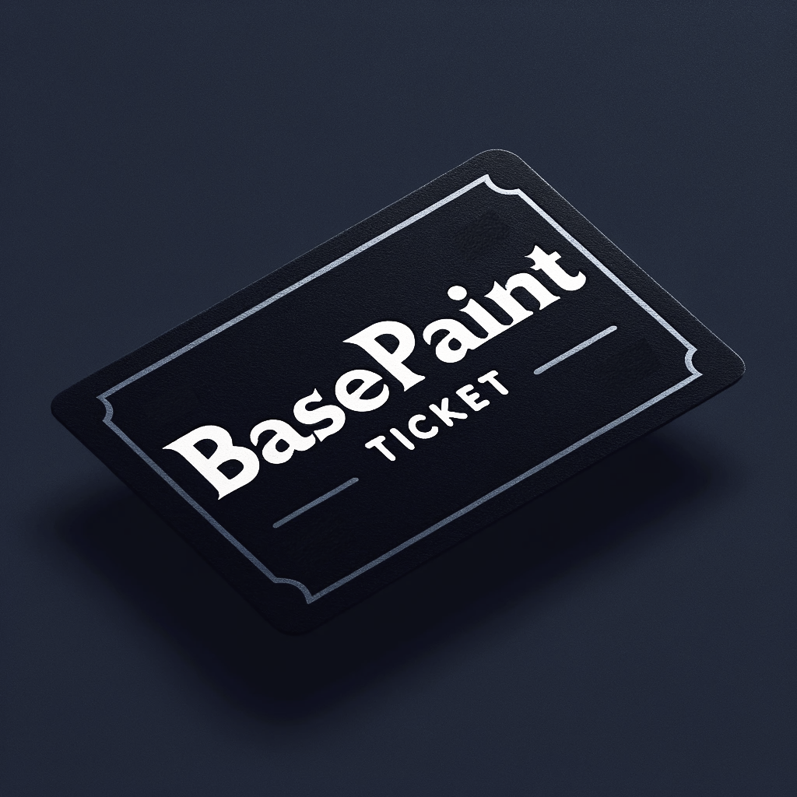
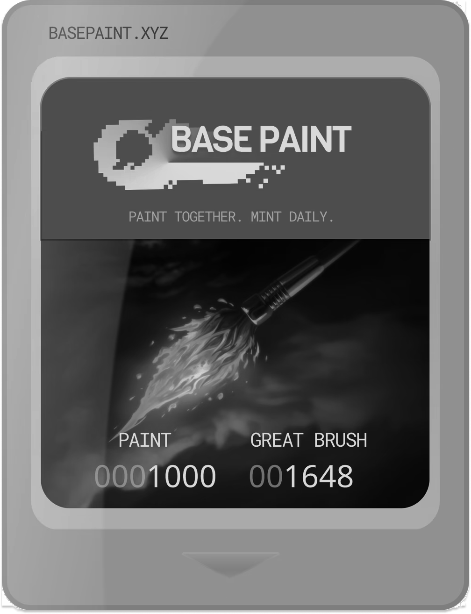

## BasePaint Raffle 🎟️

Buy tickets and win a brush for the day! [Deployed Website](https://anader123.github.io/basepaint-raffle/)

BasePaint Raffle is built on top of [BasePaint](https://basepaint.xyz/), a shared onchain pixel canvas. BasePaint has ERC-721 brushes that allow painters to contribute a certain amount of pixels a day.

<div align="center">

</div>

The raffle contract controls a 1,000 pixel brush. Whoever wins the raffle can use the brush for a day to paint on the canvas. Painters earn ETH proportional to
the number of pixels placed.

<div align="center">

</div>

### Deployment Addresses on Base-Sepolia Testnet

```
  basepaintRaffle: 0xe9e6c9336e6f2df3dc4e3c8b285dad2fe7a625e0,
  basepaintBrush: 0x67303ec67f723c807fffaf796c2c489327d3c756,
  basepaintCore: 0xd1f0b838a0dc3a1a77cd2a4fb51a346aeccd2f5d,
```

### Crypto Tech Used

- ERC-721
- Onchain Metadata Rendering
- BasePaint Contracts
- Wagmi/Viem
